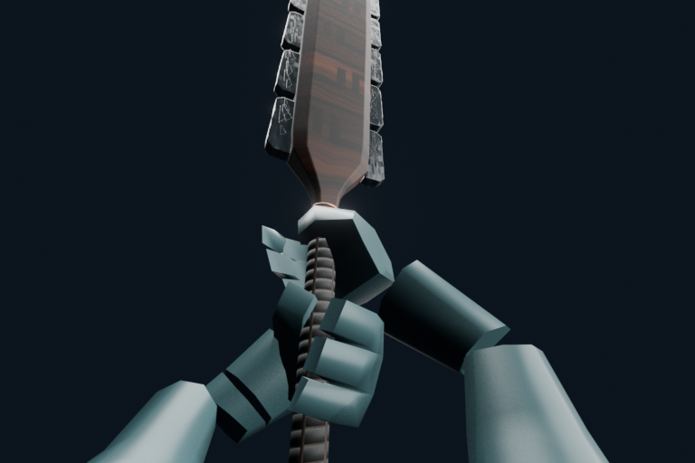
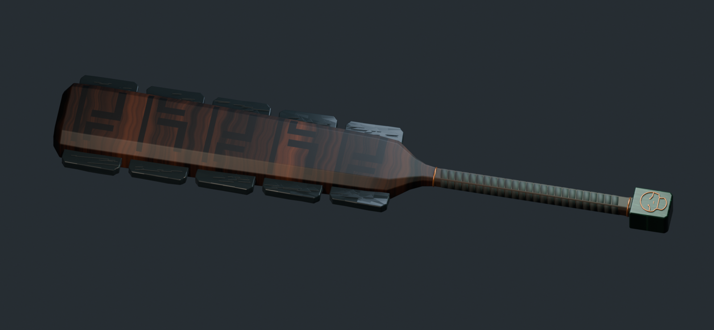
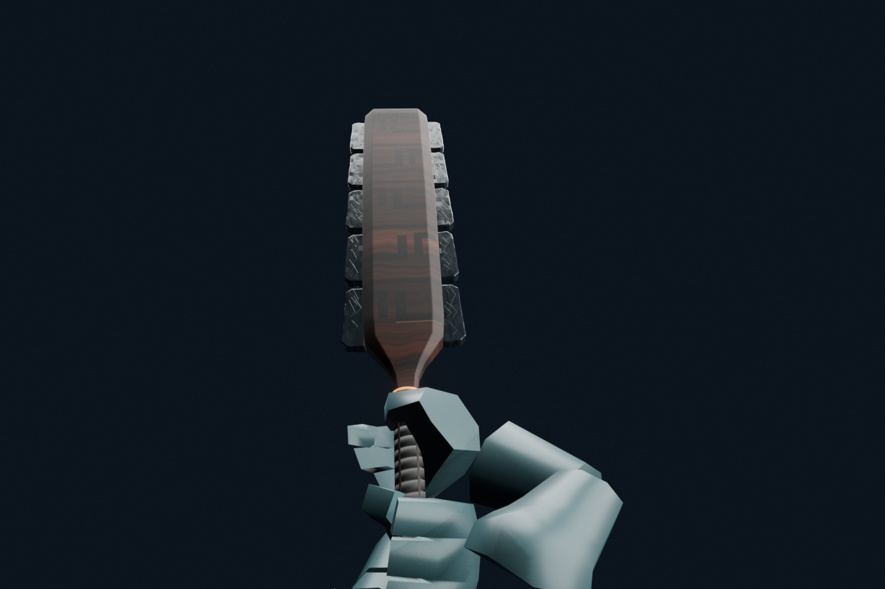
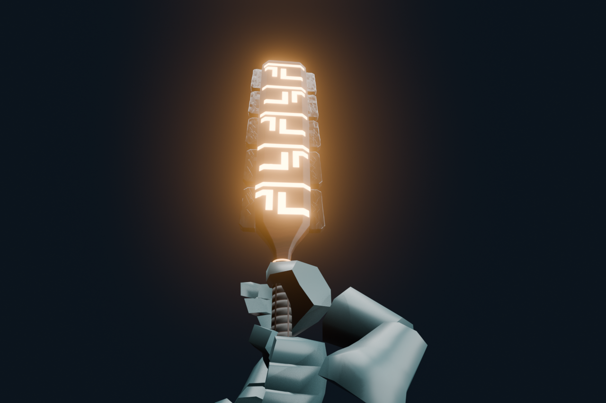
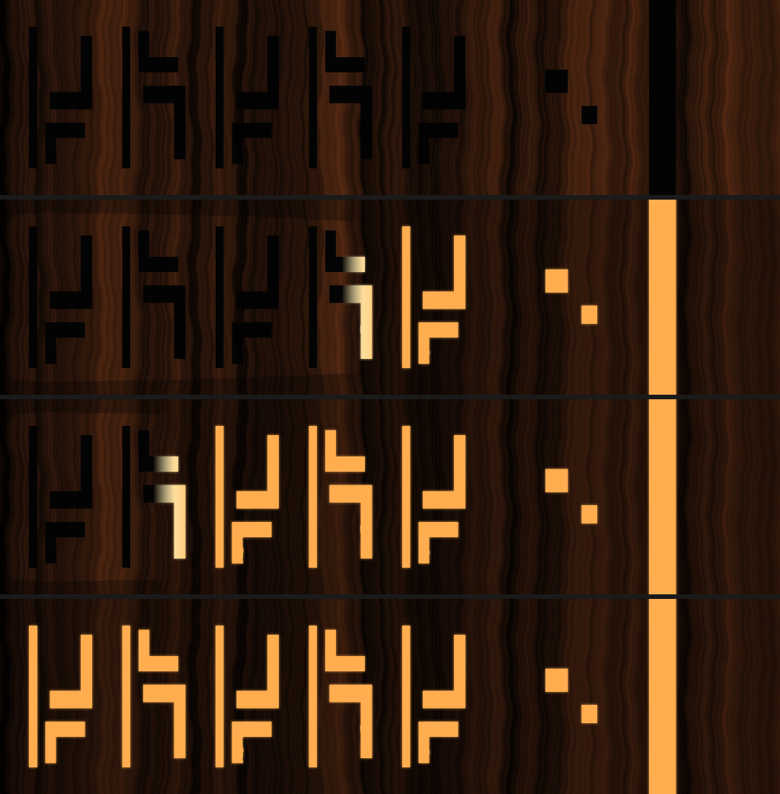

# shootthemoon — Macuahuitl v11 양손 대검 뷰모델

OVERDARE 게임 `onlyoneshot` 의 `maxico` 직업 뷰모델. 한손 → 양손 대검 전환(v11) 결과물.

| 무기 모델 (TwoHand 1.55 m) | 변신 — 문양이 손잡이 쪽부터 차오름 | 변신 완료 |
|---|---|---|
|  |  |  |

발광 텍스처 3단계 (채움 35% / 70% / 100%) — 궁 쓰면 이 순서로 바뀐다.

| 문서 | 내용 |
|---|---|
| [SPEC_v11_KO.md](SPEC_v11_KO.md) | **명세서 — 현재 상태 기준** (파트·좌표 규약·클립 32개·변신 발광·게임 반영·OVERDARE 규칙) |
| [WORK_LOG_KO.md](WORK_LOG_KO.md) | 작업 기록 (요청 → 원인 → 조치) |
| [CLAUDE_HANDOFF.md](CLAUDE_HANDOFF.md) | Blender 제작 단계 세부 수치 (v11.0~v11.4) |
| [SKILL_CATALOG_KO.md](SKILL_CATALOG_KO.md) | 동작 영상 목록 |
| [Import_OVERDARE/IMPORT_GUIDE_KO.md](Import_OVERDARE/IMPORT_GUIDE_KO.md) | Studio 임포트 절차 |

| 폴더 | 내용 |
|---|---|
| `Clips/` `Transitions/` | 동작 32개 · 전환 20개 Lua 클립 |
| `Scripts/` | 제작 스크립트 (Blender 백그라운드 실행) |
| `Import_OVERDARE/` | 게임 임포트 패키지 (Lua · 텍스처 · 배치표) |
| `Game_Integration/` | 게임에 들어간 스크립트 현재본 사본 |
| `history/pipeline_v01_v03/` | v11 이전 v01~v03 제작·검증 스크립트 |

메시(`.blend` `.fbx`), 영상(`.mp4`), 체크포인트, QA 렌더 프레임, v01~v10 작업 파일은 용량 때문에 git 에서 제외하고
[`history-v01-v11` 릴리스](https://github.com/ShootTheMoon/macuahuitl-viewmodel/releases/tag/history-v01-v11)에 올려 두었다.

| 릴리스 파일 | 내용 |
|---|---|
| `v11_source_blend_fbx_motions.zip` | v11 `.blend` · 베이스 FBX · 메시 · 스킨 · 동작 미리보기 영상 |
| `v11_checkpoints.zip` / `v11_qa_renders.zip` | 단계별 체크포인트 `.blend`, QA 렌더 프레임 |
| `v11_snapshot_20260914.zip` · `v11_weapon_only.zip` | 9/14 v11 스냅샷, 무기 단독 패키지 |
| `v10_rework.zip` · `v01_originals.zip` | v10 리워크, 최초 한손·곤봉·양손 모델 |
| `pipeline_v0{1,2,3}_*.zip` · `drive_export_20260911.zip` | v01~v03 에셋·렌더 출력 |
| `viewmodel_wip_20260909.zip` · `v03_preview.mp4` | 초기 뷰모델 WIP, v03 미리보기 |
